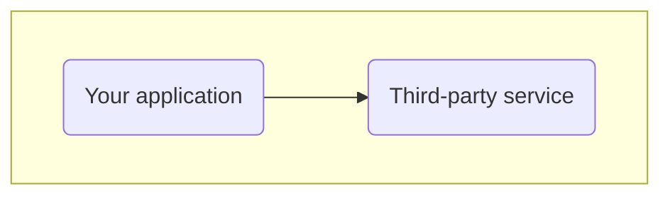
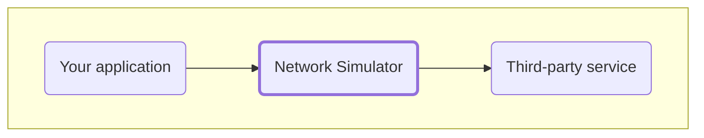
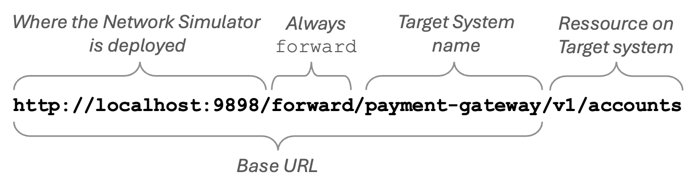
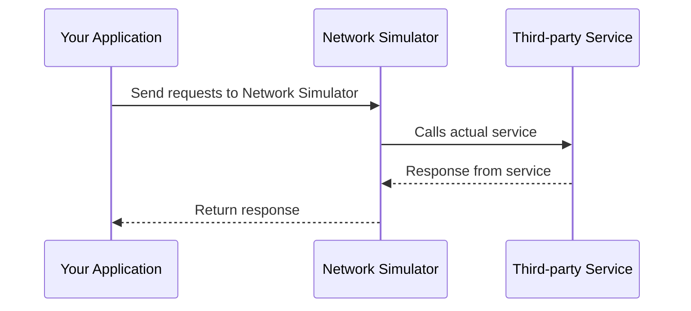
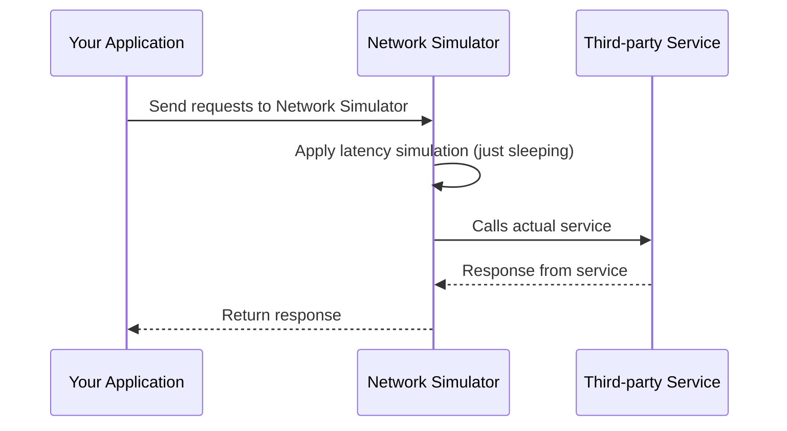
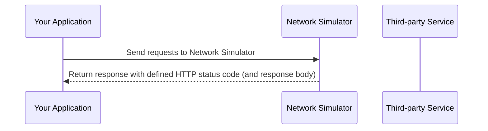

# Network Simulator


## Introduction

This application is designed to simulate various network conditions by acting as a proxy between clients and target services. 
It allows users to configure scenarios such as latency, bandwidth limitations, HTTP status codes, and responses.
The application provides a user-friendly interface for configuring these scenarios.

It is useful for testing how applications behave under different network conditions, helping developers and testers to ensure robustness and reliability.

The idea is, that you only have to change the target URL of your application to point to this network simulator,
and then configure the desired network conditions through the provided UI.

### Use case

You have an application that relies on a third-party service. 
You want to test how your application behaves when the third-party service is slow, returns errors, or has limited bandwidth. 


## Network Simulator as proxy

By using this network simulation application as a proxy,
you can simulate these conditions without modifying your application or the third-party service.
You simply insert the network simulator as a proxy between your application and the third-party service.



## How to use Network Simulator

Lets say you have an application that calls a third-party service at the URL: `https://payment-gateway.com/`.
The payment gateway has an OpenAPI specification, where you have generated a client for it.

It has an operation to list accounts on: `GET /v1/accounts`.

You therefore have set a `baseURL` for you client to `https://payment-gateway.com` and the client can then call the operation with the full URL: `https://payment-gateway.com/v1/accounts`.

### URL Structure for calling through Network Simulator

To use the Network Simulator, you first need to define a target system in the Network Simulator UI.
You can name it `payment-gateway` and set the target URL to `https://payment-gateway.com`.

You must then change the `baseURL` of your client to point to the Network Simulator instead.

Assuming the Network Simulator is running locally on port `9898`, you would set the `baseURL` to `http://localhost:9898/forward/payment-gateway`.

So, by setting your client's `baseURL` to `http://localhost:9898/forward/payment-gateway`, all requests to the payment gateway will now go through the Network Simulator.
You can then configure different network and the operation `GET /v1/accounts` will be called as `http://localhost:9898/forward/payment-gateway/v1/accounts`.

The URL structure is as follows:



# Building and Running

## Prerequisites

- **Docker**: Ensure you have Docker installed on your machine. You can download it from [here](https://www.docker.com/get-started).
- **PostgreSQL Database**: The application requires a PostgreSQL database. You can either set up a local PostgreSQL instance or use a Docker container.

## Running the Application

There are two main ways to run the application:
1. Running from the command line
2. Running with Docker Compose

The application supports using a PostgreSQL database or an in-memory H2 database.

The application is internally exposed on port `9898`.

### Running command line

```
docker run \
  --name network-simulator-app \
  -p 9898:9898 \
  patrickfust/network-simulator:latest
```

Environment variables:

| Variable Name                   | Description                                                    | Default Value                                 |
|---------------------------------|----------------------------------------------------------------|-----------------------------------------------|
| SPRING_PROFILES_ACTIVE          | Spring profile to use (e.g., `docker`, `local-postgres`, `h2`) | `h2`                                          |  
| JDBC_URL                        | JDBC URL for PostgreSQL database connection                    | `jdbc:postgresql://db:5432/network_simulator` |
| JDBC_USERNAME                   | Username for PostgreSQL database connection                    | `network_simulator_user`                      |
| JDBC_PASSWORD                   | Password for PostgreSQL database connection                    | `network_simulator_password`                  |
| DDL_AUTO                        | Hibernate DDL auto configuration (`update`, `create`, etc.)    | `update`                                      |
| SHOW_SQL                        | Show SQL statements in logs (`true` or `false`)                | `false`                                       |
| CHUNK_SIZE                      | Chunk size for throttling simulation in bytes                  | `100`                                         |
| NETWORK_SIMULATOR_CONFIGURATION | JSON string for initial configuration of the network simulator | `null`                                        |

#### Example for local PostgreSQL

This is how you would run the application with a local PostgreSQL database and a chunk size of 1024 bytes:
```
docker run \
  --name network-simulator-app \
  -p 9898:9898 \
  --env SPRING_PROFILES_ACTIVE=docker \
  --env JDBC_URL=jdbc:postgresql://host.docker.internal:5532/network_simulator \
  --env JDBC_USERNAME=network_simulator_user \
  --env JDBC_PASSWORD=network_simulator_password \
  --env CHUNK_SIZE=1024 \
  patrickfust/network-simulator:latest
```

### Running with Docker Compose

To run the application using Docker Compose, use the following command in the root directory of this project:

`docker compose up`

## Building the Application

If you want to build the Docker image yourself, you can use the following command:

`docker build -t patrickfust/network-simulator:latest .`

# Sequence diagrams

These are sequence diagrams illustrating the request and response flow with and without configured simulation scenarios.
They are examples, and you can adapt them to your specific use cases.

## Default behavior (no simulation)

If no scenarios are configured, the application simply forwards requests and responses between the client and the target service.



## Configured simulation scenario with latency

When a simulation scenario is configured, the application applies the specified network conditions to the requests and responses.
In this case, we illustrate a scenario with added latency.


    
## Configured simulation scenario with defined HTTP status code

In this case, we illustrate a scenario where we have specified a specific response code.
You may also specify the response body if desired.

In this case, the target service is not called at all, but we simulate the response directly.

This could be useful for testing how your application handles different error codes from the third-party service, 
like `404 Not Found`, `429 Too many requests` or `500 Internal Server Error`.



# Features

## Core Functionality
- **Network Simulation Proxy**: The application acts as a proxy that can simulate various network conditions:
  - Latency simulation (delay in network responses)
  - Bandwidth limitations (throttling network speed)
  - Different HTTP status codes (200, 404, 500, etc.)
  - Packet loss simulation (random packet dropping) [^1]
- **User-Friendly Interface**: Provides an intuitive dashboard to configure and manage simulation scenarios
- **Configuration Management**: Support for saving and loading different scenario configurations [^1]
- **Backend Service**: Handles actual simulation logic with RESTful APIs

# Technical Specifications

## Backend
- **Technology Stack**: Java 25 with Spring Boot 4 framework
- **Database**: PostgreSQL for storing scenario configurations and logs
- **APIs**: RESTful services exposed for frontend interaction
- **Configuration Path**: All configurations handled under path `/api/`
- **Proxy Behavior**: Everything after the path `/forward/{systemName}` are proxied to target service with applied simulation scenarios

Read more about the backend and how it works [here](backend)

## Frontend
- **Technology**: Angular 21
- **Communication**: RESTful APIs for backend interaction
- **Dashboard**: Provides user interface for scenario management

Read more about the frontend and how it works [here](frontend)

# Bruno

If you haven't cloned the network-simulator git repository, you can do so by clicking the button below.

[](https://fetch.usebruno.com?url=git%40github.com%3Apatrickfust%2Fnetwork-simulator.git "target=_blank rel=noopener noreferrer")

The Bruno collections are located in the `bruno` folder.

## Generating Bruno collections

If you want to generate the Bruno collections yourself, you can do so from the OpenAPI specification.

1. Install [Bruno CLI](https://www.usebruno.com/docs/cli/installation)
2. Start by downloading the OpenAPI specification from `http://localhost:9898/v3/api-docs` and save it as `network-simulator.json`
3. Run the following command to import the OpenAPI specification and generate the Bruno collection:
`bru import openapi --source network-simulator.json --output=bruno/network-simulator`

# Demo - Test Containers

You can use Test Containers to run integration tests using the network simulator application.

In the folder `demo` you can find a simple demo project that shows how to do use Network Simulator in your tests.

[^1]: Feature is planned but not yet implemented.
