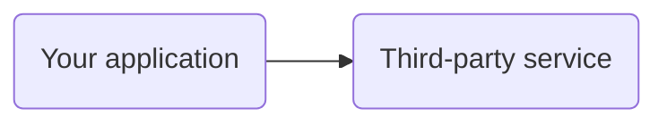
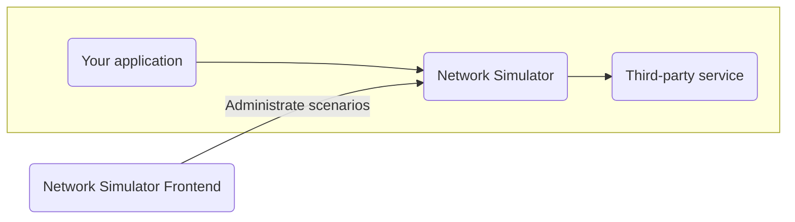
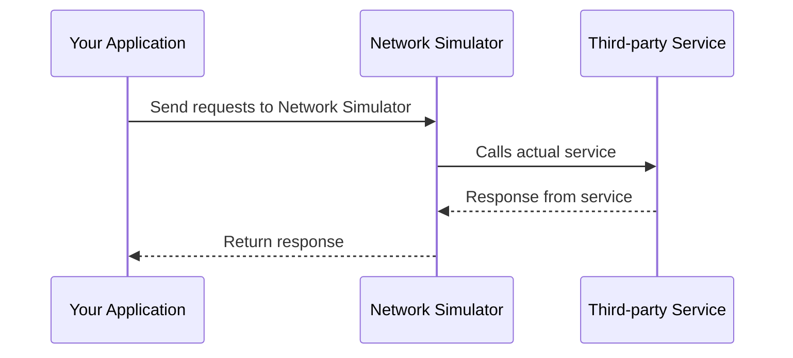
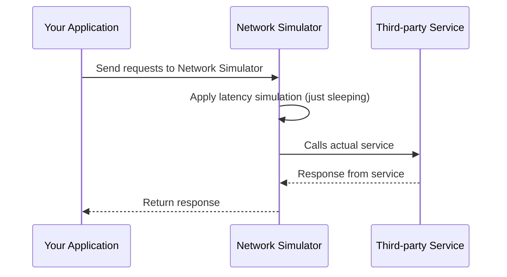
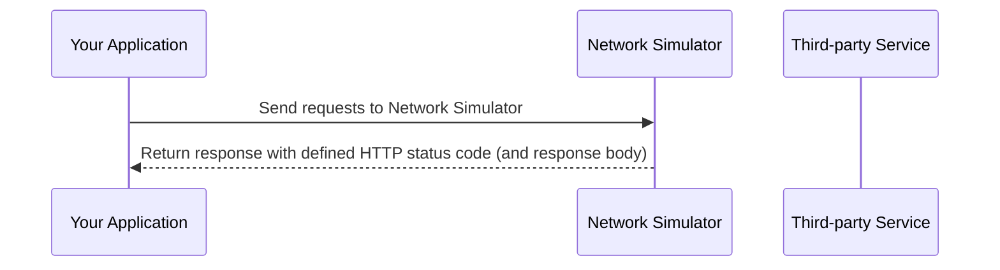

# Network Simulator

## Introduction

This application is designed to simulate various network conditions by acting as a proxy between clients and target services. 
It allows users to configure scenarios such as latency, bandwidth limitations, HTTP status codes, and responses.
The application provides a user-friendly interface for configuring these scenarios.

It is useful for testing how applications behave under different network conditions, helping developers and testers to ensure robustness and reliability.

The idea is, that you only have to change the target URL of your application to point to this network simulator,
and then configure the desired network conditions through the provided UI.

### Use case

You have an application that relies on a third-party service. 
You want to test how your application behaves when the third-party service is slow, returns errors, or has limited bandwidth. 

### Network Simulator as proxy

By using this network simulation application as a proxy,
you can simulate these conditions without modifying your application or the third-party service.
You simply insert the network simulator as a proxy between your application and the third-party service.

## Sequence diagrams

These are sequence diagrams illustrating the request and response flow with and without configured simulation scenarios.
They are examples and you can adapt them to your specific use cases.

### Default behavior (no simulation)

If no scenarios are configured, the application simply forwards requests and responses between the client and the target service.

### Configured simulation scenario with latency

When a simulation scenario is configured, the application applies the specified network conditions to the requests and responses.
In this case, we illustrate a scenario with added latency.

    
### Configured simulation scenario with defined HTTP status code

In this case, we illustrate a scenario where we have specified a specific response code.
You may also specify the response body if desired.

In this case, the target service is not called at all, but we simulate the response directly.

This could be useful for testing how your application handles different error codes from the third-party service, 
like `404 Not Found`, `429 Too many requests` or `500 Internal Server Error`.

## Features

### Core Functionality
- **Network Simulation Proxy**: The application acts as a proxy that can simulate various network conditions:
  - Latency simulation (delay in network responses)
  - Bandwidth limitations (throttling network speed) [^1]
  - Different HTTP status codes (200, 404, 500, etc.)
  - Packet loss simulation (random packet dropping) [^1]
- **User-Friendly Interface**: Provides an intuitive dashboard to configure and manage simulation scenarios
- **Configuration Management**: Support for saving and loading different scenario configurations [^1]
- **Backend Service**: Handles actual simulation logic with RESTful APIs

## Technical Specifications

### Backend
- **Technology Stack**: Java 25 with Spring Boot framework
- **Database**: PostgreSQL for storing scenario configurations and logs
- **APIs**: RESTful services exposed for frontend interaction
- **Configuration Path**: All configurations handled under path `/_/`
- **Proxy Behavior**: All other paths proxied to target service with applied simulation scenarios

Read more about the backend and how it works [here](backend)

### Frontend
- **Technology**: Angular 21
- **Communication**: RESTful APIs for backend interaction
- **Dashboard**: Provides user interface for scenario management

Read more about the frontend and how it works [here](backend)

[^1]: Feature is planned but not yet implemented.
