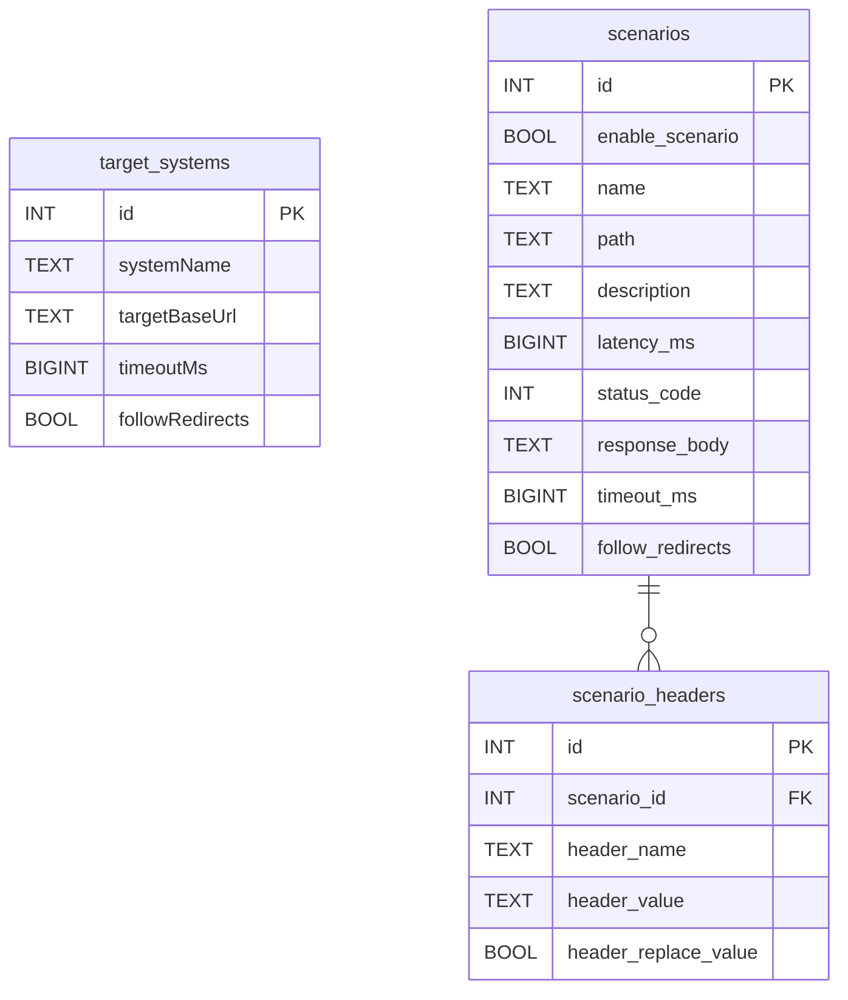

# Network Simulation Proxy Backend

This is the backend component of the network simulator application, built with Spring Boot and Java 25.

## Features Implemented

- REST API endpoints for managing network simulation scenarios
- Database persistence using PostgreSQL
- Scenario model with network configuration parameters
- Basic proxy service with network simulation capabilities

## What is proxied?

The backend application listens for incoming HTTP requests. 

Requests made to the path `/api` are handled by the backend itself, providing API endpoints for managing simulation scenarios.
The path `/forward/{systemName}` and everything under that, are proxied to the target service, applying the configured network simulation scenarios.

### OpenAPI/Swagger Documentation

The API documentation is available at:
http://localhost:9898/swagger-ui/index.html

## Project Structure

```
src/
├── main/
│   ├── java/dk/fust/networksimulator/
│   │   ├── config/         # Application configuration
│   │   ├── controller/     # REST API controllers
│   │   ├── model/          # Database entities
│   │   ├── repository/     # Data access layer
│   │   ├── service/        # Business logic
│   │   └── simulations/    # Network simulation logic
│   └── resources/
│       └── application.yml # Configuration properties
└── test/                   # Unit and integration tests
```

## Scenarios

A scenario defines a set of network conditions to be applied to proxied requests.

Each scenario has a path pattern to match incoming requests and various network parameters like latency, 
bandwidth, status codes, etc.

If a path is omitted, the scenario applies to all paths.

All matching scenarios are applied to each request.

## Simulations

The application supports various network simulation scenarios.

### LatencySimulation

A simulation that introduces a fixed delay (latency) to each request before forwarding it to the target service.
The simulation runs for all active scenarios that have a defined `latencyMs`.

The delay is implemented using `Thread.sleep()` and is the sum of all the scenarios that is active.

### StatusCodeSimulation

A simulation that returns a predefined HTTP status code (and optional response body) instead of forwarding the request to the target service.

The simulation runs for all active scenarios that have a defined `statusCode`.
The first scenario that defines a `statusCode` is used, and the request is not forwarded to the target service or further simulations.

If a response body is defined in the scenario, it is included in the response.

### PassThroughSimulation

A simulation that simply passes requests and responses without any modifications.

### HeaderSimulation

A simulation that can add or modify, HTTP headers in responses.

## Running the Application

1. Ensure PostgreSQL is running and accessible
2. Update database credentials in `application.yml`
3. Run with Maven:
   ```bash
   ./mvnw spring-boot:run
   ```

## Docker Compose
The docker-compose.yml file sets up:
- PostgreSQL database with persistent storage
- Proper network configuration between services

## API Endpoints

The API Endpoints are documented using OpenAPI/Swagger and can be accessed at:
http://localhost:9898/swagger-ui/index.html

## E/R-diagram of the database

[//]: #ERD_NETWORK_SIMULATOR_START ()

[//]: #ERD_NETWORK_SIMULATOR_END ()

