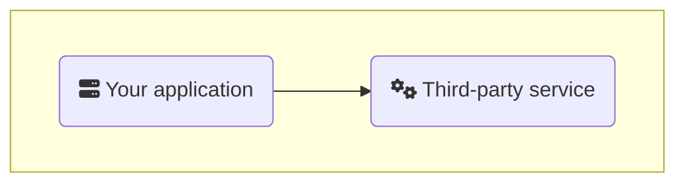
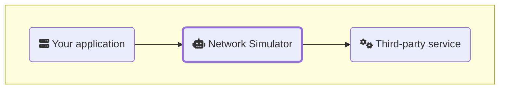
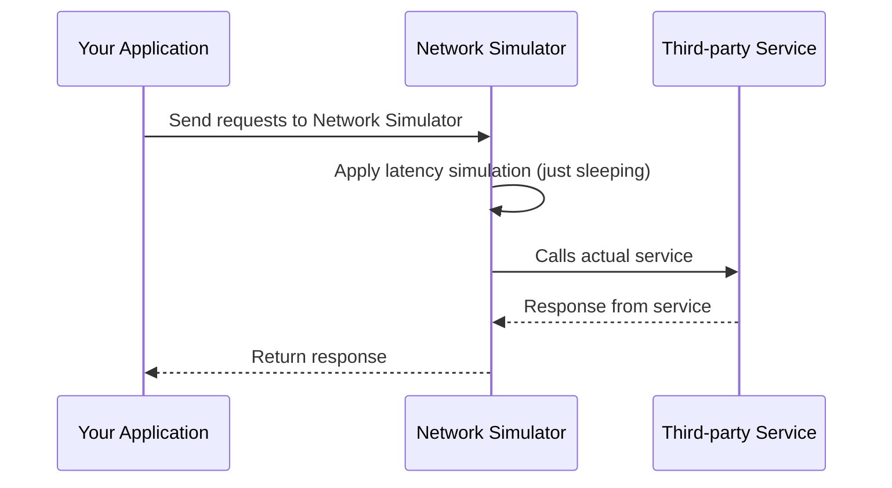
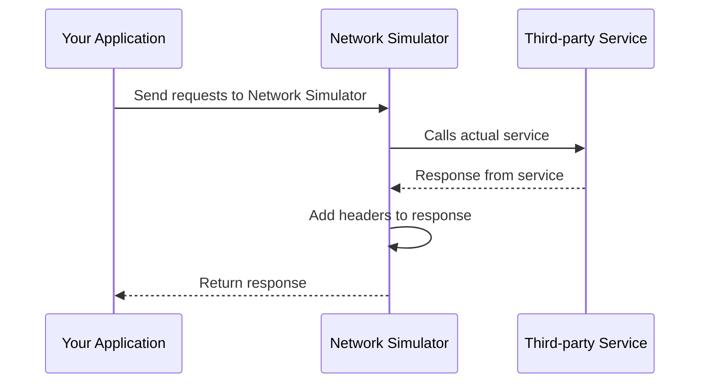
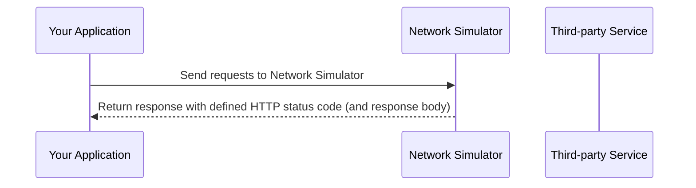

# Network Simulator

## Introduction

This application is designed to simulate various network conditions by acting as a proxy between clients and target services.
It allows users to configure scenarios such as latency, bandwidth limitations, HTTP status codes, and responses.
The application provides a user-friendly interface for configuring these scenarios.

It is useful for testing how applications behave under different network conditions, helping developers and testers to ensure robustness and reliability.

The idea is, that you only have to change the target URL of your application to point to this network simulator,
and then configure the desired network conditions through the provided UI.

## Use case

You have an application that relies on a third-party service.
You want to test how your application behaves when the third-party service is slow, returns errors, or has limited bandwidth.

### Network Simulator as proxy

By using this network simulation application as a proxy,
you can simulate these conditions without modifying your application or the third-party service.
You simply insert the network simulator as a proxy between your application and the third-party service.

# User manual

This describes how to use the Network Simulator application to configure and simulate various network conditions.

## Target Systems

A target system represents a third-party service that your application interacts with.
You can configure multiple target systems in the application.

In the top menu of the application, you can manage multiple target systems.
Choose "Target Systems" to view the list of configured target systems.
You can add a new target system by clicking the "Add Target System" button.
When adding a target system, you need to provide a name and the base URL of the target service.
You can also edit or delete existing target systems from this view.

The `System Name` defines the URL path segment that your application will use to route requests through the network simulator.

Set your application's base URL to point to the network simulator,
using the format `http://<network-simulator-host>/forward/<System Name>`.

For example, if you set the `System Name` to `thirdparty` and the base URL to `https://api.thirdparty.com`,
your application should send requests to `http://<network-simulator-host>/forward/thirdparty/...` to have them forwarded to `https://api.thirdparty

## Scenarios

A scenario defines specific network conditions to be applied to requests and responses for a target system..
You can configure multiple scenarios for each target system (or all target systems).

All scenarios that match a request will be applied.

To manage scenarios, navigate to the "Scenarios" section in the top menu.
You can add a new scenario by clicking the "Add Scenario" button.

If you don't specify a path, all requests to the target system will match the scenario.

If you specify a path, only requests matching that path will apply the scenario. The path can be a regular expression, like `/api/v1/.*` to match all requests under `/api/v1/`.

If no scenario is matched, the request will be forwarded to the target service without any modifications and the response from the target system is returned untouched.

Depending on what you have filled out in the scenario, different network conditions (simulations) will be applied.

### Timeout

If you configure a timeout in the scenario, the application will simulate a timeout by not responding to the request within the specified time.
This will override the timeout setting of the target system. 
Multiple scenarios with timeouts will sum up the timeouts.

### Latency

When a latency is specified, the application simply waits that amount of time before forwarding the request to the target service.

### Headers

You can specify headers to be added to the response before returning the response headers and body from the target system..

### Status Code

In this case, we illustrate a scenario where we have specified a specific response code.
You may also specify the response body if desired.

In this case, the target service is not called at all, but we simulate the response directly.

  <strong><i class="fa-solid fa-triangle-exclamation"></i> Warning!</strong> 
  If Status Code is specified in a scenario, the target service will not be called.

This could be useful for testing how your application handles different error codes from the third-party service,
like `404 Not Found`, `429 Too many requests` or `500 Internal Server Error`.

### Throttling

When throttling is specified, the application will limit the bandwidth of the response to the specified number of bytes per second.
